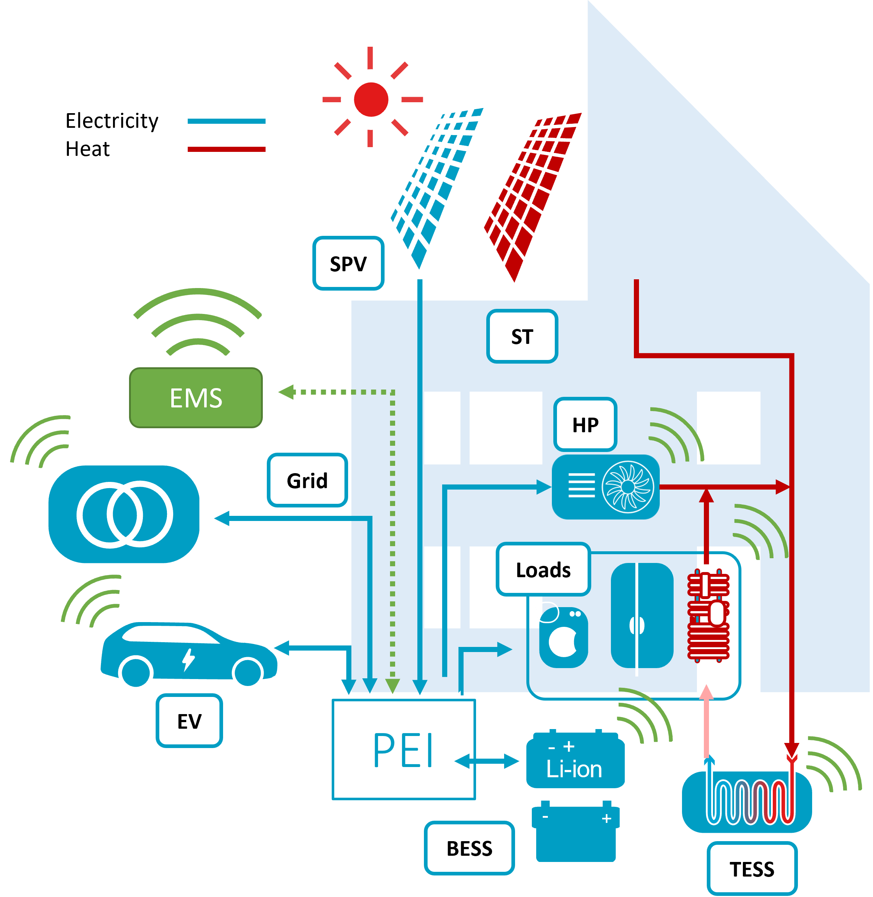
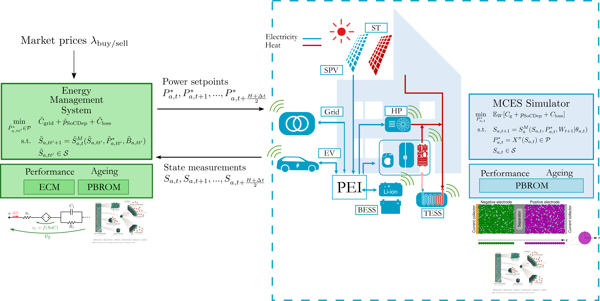

# EMSmodule



**‘The aim of FLEXINet is a system that accelerates the energy transition. We hope to make a substantial contribution to reaching climate targets by cleverly combining various techniques – think of blending recycled batteries with flexible heat pumps and the charging of electric cars.’**

## Description
The code implements the Energy Management System (EMS), of Results 5 and 6 of the project. The EMS is a software that controls the energy flows in the building, in order to minimize the energy costs. The EMS is implemented in `Julia`, and it is based on [JuMP.jl](https://jump.dev/) and [InfiniteOpt.jl](https://github.com/infiniteopt/InfiniteOpt.jl). The EMS is an optimization based controller and it sends the optimal setpoints to the different devices.

The workflow is the following:



## Badges
PENDING

## Installation
The common installation is followed. If necessary, add directly this repository to the Julia environment.

```julia
julia> ]
Pkg> add https://gitlab.tudelft.nl/dces/emsmodule.git # main
using EMSmodule
```

## Usage

The functions to run the EMS are in the files:
```julia
makeEMSobjs.jl # creates the mutable structs and data loading
EMSfns.jl # functions to create the optimization model
ESSfns.jl # functions to add the ESS to the optimization models
makeEMSplots.jl # plotting functions
makeForecasts.jl # forecasting functions
simEMS.jl # simulation functions
```

Use examples liberally, and show the expected output if you can. It's helpful to have inline the smallest example of usage that you can demonstrate, while providing links to more sophisticated examples if they are too long to reasonably include in the README.

```julia
using EMSmodule
ADD EXAMPLES
```

## Sequential Decision Making

Following the Universal Modelling Framework (UMF) this package implements Direct Lookahead (DLA) Policies. The DLA is a model-based policy that uses a model of the system to predict the future and optimize the control actions. The available DLAs are a day-ahead (DA) planner and a Model Predictive Controller (MPC). The basic algorithm is depicted in the following figure:


The DA planner uses a model of the system to predict the future and optimize the control actions for the next 24 hours. The MPC uses a model of the system to predict the future and optimize the control actions for the next 24 hours, but it also uses the actual measurements to update the model and the optimization problem every hour. The MPC is an economic mixed integer non-linear MPC (MINLP-eMPC) receding horizon controller. This last one is under development and debug.

## Forecasting

Pending


## Support
For bug or feature requests, please open an issue. For usage questions or extensions please contact developers.

## Roadmap
If you have ideas for releases in the future, it is a good idea to list them in the README.

## Contributing
State if you are open to contributions and what your requirements are for accepting them.

For people who want to make changes to your project, it's helpful to have some documentation on how to get started. Perhaps there is a script that they should run or some environment variables that they need to set. Make these steps explicit. These instructions could also be useful to your future self.

You can also document commands to lint the code or run tests. These steps help to ensure high code quality and reduce the likelihood that the changes inadvertently break something. Having instructions for running tests is especially helpful if it requires external setup, such as starting a Selenium server for testing in a browser.

## Authors and acknowledgment

This repository contains the work produced for the [FLEXINET](https://www.tudelft.nl/en/eemcs/cooperation/flexinet) project by the [DCE&S group](https://www.tudelft.nl/en/eemcs/the-faculty/departments/electrical-sustainable-energy/dc-systems-energy-conversion-storage), Electrical Sustainable Energy Dept. of the TU Delft. The work belongs to Dario Slaifstein, Gautam Rituraj, and Joel Alpizar.

## License
For open source projects, say how it is licensed. PENDING

## Project status
Under development.

# References
## Getting started

To make it easy for you to get started with GitLab, here's a list of recommended next steps.

Already a pro? Just edit this README.md and make it your own. Want to make it easy? [Use the template at the bottom](#editing-this-readme)!

## Add your files

- [ ] [Create](https://docs.gitlab.com/ee/user/project/repository/web_editor.html#create-a-file) or [upload](https://docs.gitlab.com/ee/user/project/repository/web_editor.html#upload-a-file) files
- [ ] [Add files using the command line](https://docs.gitlab.com/ee/gitlab-basics/add-file.html#add-a-file-using-the-command-line) or push an existing Git repository with the following command:

```
cd existing_repo
git remote add origin https://gitlab.tudelft.nl/dces/emsmodule.git
git branch -M main
git push -uf origin main
```

## Integrate with your tools

- [ ] [Set up project integrations](https://gitlab.tudelft.nl/dces/emsmodule/-/settings/integrations)

## Collaborate with your team

- [ ] [Invite team members and collaborators](https://docs.gitlab.com/ee/user/project/members/)
- [ ] [Create a new merge request](https://docs.gitlab.com/ee/user/project/merge_requests/creating_merge_requests.html)
- [ ] [Automatically close issues from merge requests](https://docs.gitlab.com/ee/user/project/issues/managing_issues.html#closing-issues-automatically)
- [ ] [Enable merge request approvals](https://docs.gitlab.com/ee/user/project/merge_requests/approvals/)
- [ ] [Set auto-merge](https://docs.gitlab.com/ee/user/project/merge_requests/merge_when_pipeline_succeeds.html)

## Test and Deploy

Use the built-in continuous integration in GitLab.

- [ ] [Get started with GitLab CI/CD](https://docs.gitlab.com/ee/ci/quick_start/index.html)
- [ ] [Analyze your code for known vulnerabilities with Static Application Security Testing (SAST)](https://docs.gitlab.com/ee/user/application_security/sast/)
- [ ] [Deploy to Kubernetes, Amazon EC2, or Amazon ECS using Auto Deploy](https://docs.gitlab.com/ee/topics/autodevops/requirements.html)
- [ ] [Use pull-based deployments for improved Kubernetes management](https://docs.gitlab.com/ee/user/clusters/agent/)
- [ ] [Set up protected environments](https://docs.gitlab.com/ee/ci/environments/protected_environments.html)

***

## Editing this README

When you're ready to make this README your own, just edit this file and use the handy template below (or feel free to structure it however you want - this is just a starting point!). Thanks to [makeareadme.com](https://www.makeareadme.com/) for this template.

## Suggestions for a good README

Every project is different, so consider which of these sections apply to yours. The sections used in the template are suggestions for most open source projects. Also keep in mind that while a README can be too long and detailed, too long is better than too short. If you think your README is too long, consider utilizing another form of documentation rather than cutting out information.
