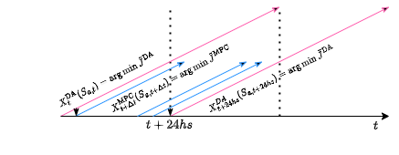
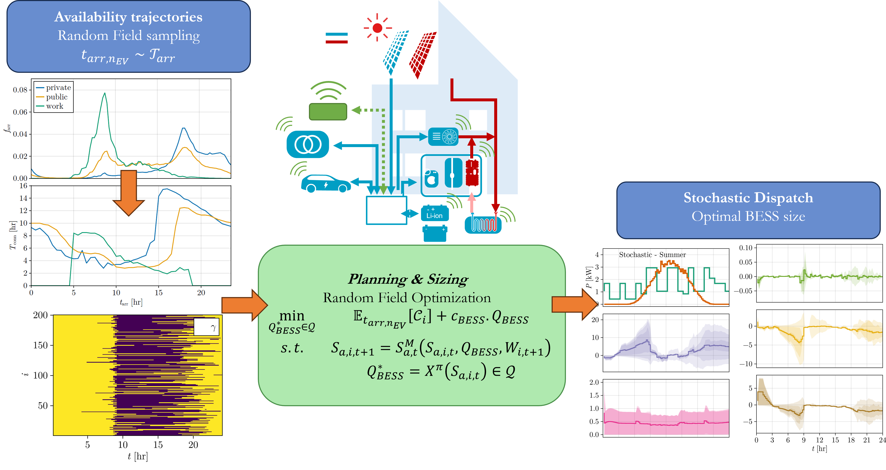

# Sequential Decision Analytics (SDA)

- [Sequential Decision Analytics (SDA)](#sequential-decision-analytics-sda)
  - [Sequential Decision Making](#sequential-decision-making)
    - [Day-Ahead Planner](#day-ahead-planner)
    - [Model Predictive Controller](#model-predictive-controller)
  - [Sizing and Planning](#sizing-and-planning)
  - [Forecasting](#forecasting)
  - [References](#references)

## Sequential Decision Making

Following the Universal Modelling Framework (UMF) [1] this package implements Direct Lookahead (DLA) Policies.

The Energy Management System (EMS) aims to minimize the operation costs of the building by controlling the energy flows. The EMS is an optimization-based controller that sends the optimal setpoints to the different devices. The sequential decision problem (SDP) is:

$$
\begin{equation}
    \begin{aligned}
        \min_{P^*_{a,t}} \quad & \mathbb{E}_{W}[ C_{\textrm{grid}}+C_{\textrm{loss}}+p_{\textrm{SoCDep}}]\\
        \textrm{s.t.} \quad & S_{a,t+1}=S^M_a (S_{a,t}, P^*_{a,t}, W_{t+1}|\theta_{a,t}) \\
                    & P_{a,t}^*=X^{\pi}_t(S_{a,t}) \in \mathcal{P} & \forall a \in \mathbb{A} \\
                    & S_{a,t} \in \mathcal{S} & \forall a \in \mathbb{A}
    \end{aligned}
\end{equation}
$$

where $P^*_{a,t}$ is the optimal control action for asset $a$ at time $t$, $C_{\textrm{grid}}$ is the cost of the grid energy, $C_{\textrm{loss}}$ is the cost of the capacity loss, $p_{\textrm{SoCDep}}$ is the penalty for the EV state of charge deviation, $S_{a,t}$ is the state of asset $a$ at time $t$, $S^M_a$ is the model of asset $a$, $W_{t+1}$ is the exogenous information at time $t+1$, $\theta_{a,t}$ is the parameters of asset $a$ at time $t$, $X^{\pi}_t$ is the policy at time $t$, $\mathcal{P}$ is the set of possible control actions, and $\mathcal{S}$ is the set of possible states.

The DLA is a model-based policy that uses a model of the system $\tilde{S}_t^M$ to predict the future and optimize the control actions. The available DLAs are a day-ahead (DA) planner and a Model Predictive Controller (MPC) to participate in the continous intra-day market. The basic algorithm is depicted in the following figure:

The DA planner uses a model of the system to predict the future and optimize the control actions for the next 48 hours (pink arrows). The MPC uses a model of the system to predict the future and optimize the control actions for the next 24 hours (cyan arrows), but it also uses the actual measurements to update the model and the optimization problem every hour. The MPC is an economic mixed integer non-linear MPC (MINLP-eMPC). The horizon can be a rolling or shrinking.

### Day-Ahead Planner

The DA planner uses a model of the system to predict the future and optimize the control actions for the next 24 hours. The Optimal Control Problem (OCP) solved by the $X^{DA}_t$ policy is:

$$
\begin{align}
        \min_{P^{DA,*}_{a,t}} \quad &  \tilde{J}^{DA} = \tilde{C}^{DA}_{\textrm{grid}}+\tilde{C}^{DA}_{\textrm{loss}}+\tilde{p}^{DA}_{\textrm{SoCDep}}+\tilde{p}^{DA}_{\textrm{TESS}}\\
        \textrm{s.t.} \quad & \tilde{S}^{DA}_{a,t+1}=\tilde{S}^M_{a,t} (\tilde{S}^{DA}_{a,t}, P^{DA,*}_{a,t}, B^{DA}_{t+1}|\theta_{a,t}) \\
                    & P_{a,t}^{DA,*}=X^{DA}_t(S_{a,t}) \in \mathcal{P} & \forall a \in \mathbb{A} \\
                    & S_{a,t} \in \mathcal{S} & \forall a \in \mathbb{A}
\end{align}
$$
    
where $P^{DA,*}_{a,t}$ is the day-ahead power dispatch for asset $a$ at time $t$, the DA superscript denotes that this is the DA planner, the $\tilde{}$ denotes approximation, $p^{DA}_{\textrm{TESS}}$ is the soft-constraint for overcharging the TESS, $B^{DA}_{t+1}$ is the belief state/forecast $t$ in the DA planner. Thus  $\tilde{S}^{DA}_{a,t}$ is the estimated state of asset $a$ at time $t$ in the DA planner.

The day-ahead cost function $\tilde{J}^{DA}$ is composed of:

$$
\begin{equation}
    \tilde{C}_{g}^{DA} = \sum_{t=1}^{T} \left( \tilde{\lambda}_{buy,t} \cdot P_{g,t}^{DA,+,*} + \tilde{\lambda}_{sell,t} \cdot P_{g,t}^{DA,-,*} \right) \Delta t 
\end{equation}
$$

$$
\begin{equation}
c_{\textrm{grid}}^{\textrm{DA}} = \frac{\lambda_{\textrm{buy}}^{\textrm{DA}} - \lambda_{\textrm{sell}}^{\textrm{DA}}}{2} |P_{\textrm{grid}}^{\textrm{DA}}|+ \frac{\lambda_{\textrm{buy}}^{\textrm{DA}} + \lambda_{\textrm{sell}}^{\textrm{DA}}}{2} P_{\textrm{grid}}^{\textrm{DA}} 
\end{equation}
$$

$$
\begin{equation}
    C_{\text{loss}}^{DA}=w_{\text{loss}}.c_{\text{loss}}.\sum_{t=0}^{T}\sum_{sa}{i_{\text{loss},sa,t}^{DA}.\Delta t},\ \forall\ sa \subset a, 
\end{equation}
$$

$$
\begin{equation}
    p_{\textrm{SoCDep}}^{DA}=w_{\textrm{SoC}}.||\varepsilon^{DA}_{\textrm{SoC}, t_{\text{dep}}}||_2^2
\end{equation}
$$

$$
\begin{equation}
    p_T^{DA}  = w_T \max(0, SoC^{DA}_{\textrm{TESS}}-\overline{SoC}_{\textrm{TESS}}) + \max(0, \underline{SoC}_{\textrm{TESS}}-SoC^{DA}_{\textrm{TESS}}) 
\end{equation}
$$

### Model Predictive Controller

The MPC uses a model of the system to predict the future and optimize the control actions for the next 24 hours and submit offers to the continous intra-day market. The time resolution is $\Delta t ^{CT}$=15min and the re-scheduling happens every $\Delta t ^{CT}$. The Optimal Control Problem (OCP) solved by the $X^{MPC}_t$ policy is:

$$
\begin{align}
        \min_{P^{CT,*}_{a,t}} \quad &  \tilde{J}^{CT} = \tilde{C}^{CT}_{\textrm{grid}}+\tilde{C}^{CT}_{\textrm{loss}}+\tilde{p}^{CT}_{\textrm{SoCDep}}+\tilde{p}^{CT}_{\textrm{TESS}}\\
        \textrm{s.t.} \quad & \tilde{S}^{CT}_{a,t+1}=\tilde{S}^M_{a,t} (\tilde{S}^{CT}_{a,t}, P^{CT,*}_{a,t}, B^{CT}_{t+1}|\theta_{a,t}) \\
                    & P_{a,t}^{CT,*}=X^{CT}_t(S_{a,t}) \in \mathcal{P} & \forall a \in \mathbb{A} \\
\end{align}
$$

where all the components are the same as the DA planner, but the CT superscript denotes that this is the MPC controller, and the $\tilde{}$ denotes approximation. The MPC cost function $\tilde{J}^{CT}$ is composed of the same elements as before, except for the grid cost function:

$$
\begin{equation}
    \tilde{c}_{\textrm{grid}}^{\textrm{CT}} =  \frac{\tilde{\lambda}_{\textrm{buy}}^{\textrm{CT}} - \tilde{\lambda}_{\textrm{sell}}^{\textrm{CT}}}{2} \left| P_{\textrm{grid}}^{\textrm{CT}}-P_{\textrm{grid}}^{\textrm{DA}} \right|+ \frac{\tilde{\lambda}_{\textrm{buy}}^{\textrm{CT}} + \tilde{\lambda}_{\textrm{sell}}^{\textrm{CT}}}{2}  \left(P_{\textrm{grid}}^{\textrm{CT}} - P_{\textrm{grid}}^{\textrm{DA}} \right) 
\end{equation}
$$

which tries to minimize the cost of the grid energy by comparing the DA and CT power dispatches. Buying less than $P_{g} > 0$ and selling more than $P_{g} < 0$, whenever possible. The MPC also includes the submission of offers to the continous intra-day market. The offers are based on the predicted prices and the predicted power dispatch. The offers are submitted every $\Delta t ^{CT}$.

Its important to remark that the MPC dispatch is the actual dispatch of the assets, while the DA planner is the forecasted dispatch. The MPC uses the actual measurements to update the model and the optimization problem every 15min.

## Sizing and Planning

Besides the optimization of the operation costs, the EMS also includes the optimization of the asset size. The EMS can optimize the size of the assets by minimizing the investment costs and the operation costs. This is done through [Random Field Optimization (RFO)](https://linkinghub.elsevier.com/retrieve/pii/S0098135422001922) [2], which is an scenario-based stochastic optimization technique. The SDP is:

$$
\begin{align}
        & \min_{x^* \in \mathcal{X}} \mathbb{E}_{w_i \sim W} \left[ \mathcal{C}_i \right] + V_f\\

\textrm{s.t.} \quad & S_{a,i,t+1} = S_{a}^M\left(S_{a,i,t}, x^*, w_{i,t+1} \right) \ \forall a \in \mathbb{A}, \ i \in [1, N_s] \\
                    & x^* = X^{\pi-RFO}(S_{a,i,t}) \in \mathcal{X} \quad \forall a \in \mathbb{A} , \ i \in [1, N_s] \\
                    & S_{a,i,t} \in \mathcal{S} \quad \forall a \in \mathbb{A}, \ i \in [1, N_s]
\end{align}
$$

where $x^*$ is the optimal size of the assets and corresponding power setpoints, $\mathcal{X}$ is the set of possible sizes and schedules, $\mathcal{C}_i$ is the cost of scenario $i$, $V_f$ is the terminal cost, $S_{a,i,t}$ is the state of asset $a$ in scenario $i$ at time $t$, $S_{a}^M$ is the model of asset $a$, $w_{i,t+1}$ is the exogenous information in scenario/realization $i$ at time $t+1$, $X^{\pi}$ is the policy, and $\mathcal{S}$ is the set of possible states.

Currently the only source of uncertainty is the arrival and departure of times of the EVs. In the future this will be expanded to other sources of uncertainty. Such as: temperature, solar radiation, electrical load, and electricity prices.

The EMS is implemented in `Julia`, and it is based on [JuMP.jl](https://jump.dev/) and [InfiniteOpt.jl] ()

## Forecasting

Pending

## References
[1] Powell, W. (2022). Reinforcement Learning and Stochastic Optimization: A Unified Framework for Sequential Decisions. In Quantitative Finance (Issue 12). Wiley. https://doi.org/10.1080/14697688.2022.2135456

[2] Pulsipher, J. L., Davidson, B. R., & Zavala, V. M. (2022). Random field optimization. Computers & Chemical Engineering, 165, 107854. https://doi.org/10.1016/j.compchemeng.2022.107854