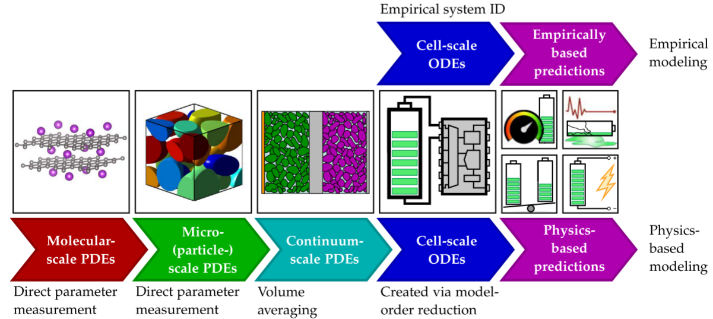
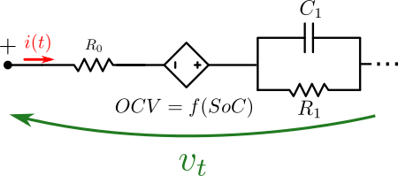
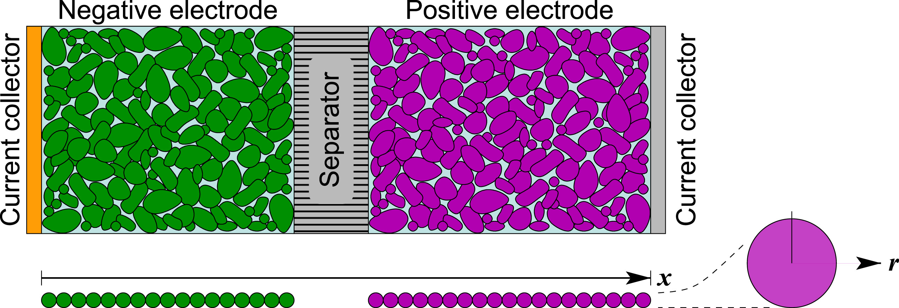
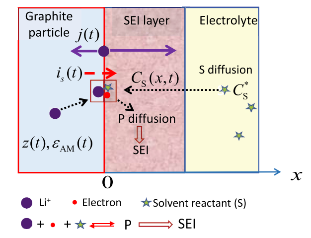

# Battery Modelling

- [Battery Modelling](#battery-modelling)
  - [Performance models $p\_{sa,t}^M$](#performance-models-p_satm)
    - [Bucket model/Coulomb counting](#bucket-modelcoulomb-counting)
    - [Equivalent Circuit models](#equivalent-circuit-models)
    - [Physics-based models](#physics-based-models)
  - [Degradation models $d\_{sa,t}^M(.)$](#degradation-models-d_satm)
    - [Empirical](#empirical)
    - [Physics-based](#physics-based)
  - [References](#references)

**‘The aim of FLEXINet is a system that accelerates the energy transition. We hope to make a substantial contribution to reaching climate targets by cleverly combining various techniques – think of blending recycled batteries with flexible heat pumps and the charging of electric cars.’**

The battery is a key component of the FLEXINet system. It is used to store energy when it is abundant and cheap, and to release it when it is scarce and expensive. The battery is also used to provide grid services, such as frequency regulation, voltage support, and peak shaving. Batteries is a critical component of the FLEXINet system, and its performance is crucial to the overall performance of the system. Two assets of the residential energy hub have batteries, the stationary battery pack (BESS) and the electric vehicle (EV).

Batteries have complex nonlinear dynamics, and several modeling techniques are presented in the literature \cite{Plett2015}. In this work, models coming from empirical and physics-based approaches are used. The modeling is divided into two different sub-models: performance and aging. Under the \ac{umf}, this is represented in the transition function $\tilde{S}^M_{sa,t}(\tilde{S}_{sa,t},x_{sa,t}|\theta_t)$, which contains both the perf. model $p_{sa,t}^M(.)$ and the aging model $d_{sa,t}^M(.)$. The performance model predicts stored energy $SoC_{sa,t}$ and terminal voltage $v_{t,sa, t}$.  The aging model is used to update the parameters of $p^M_{sa,t}(.)$, as shown in Fig. \ref{fig:saModels}.

The perf. model is then:

$$
\begin{equation}
S_{sa,t+1}=p^M_{sa,t}\left(S_{sa,t}, P_{sa,t}, B_{a,t}|\theta_{sa,t}\right)
\end{equation}
$$

\noindent{where the components of the state depend on the functional form used for the model. In general, this is a nonlinear state space system.}

The aging model $d_{sa,t}^M(.)$ is a set of equations that describe the dynamics of the performance parameters $\theta_{sa,t}$.

$$
\begin{equation}
\theta_{sa,t+1}=d_{sa,t}^M\left(S_{sa,\ t}, P_{sa,t}, B_{a,t}, \theta_{sa,t}\right)
\end{equation}
$$
Finally, a terminal constraint is implemented to ease up feasibility and mitigate symmetries in the OCP of Eq. \ref{eq:appOCP}, as in:

$$
\begin{equation}
    SoC_{\textrm{BESS},t_1} = SoC_{\textrm{BESS},t_1+T}
\end{equation}
$$
\noindent{where $t_0 \leq t_1 \leq T \leq H$. This way the \ac{ocp} is better conditioned but the planner still has the freedom to decide $SoC_{sa,T}$ \cite{Grune2017NonlinearAlgorithms}.}

## Performance models $p_{sa,t}^M$
### Bucket model/Coulomb counting

A basic \ac{bm} of the operation of a battery assumes that its output voltage $v_t$ is linear with the state of charge $SoC$, assuming no voltage drop. Hence the only equations of this model are

$$
\begin{equation}
SoC_{sa,t+1}=SoC_{sa,t}-\frac{\Delta t}{Q_{sa,t}.3600}.\eta_c.i_{sa,t} \,,
\end{equation}
$$

$$
\begin{equation}
    i_{sa,t}=\frac{P_{sa,t}}{v_{t,sa,t}.N_{s,sa}.N_{p,sa}} \,,
\end{equation}
$$
\noindent{and}

$$
\begin{equation}
    OCV_{sa,t}=a_{OCV,sa}+b_{OCV,sa}.SoC_{sa,t} \,,
\end{equation}
$$

$$
\begin{equation}
    v_{t,sa,t}=OCV_{sa,t} \,,
\end{equation}
$$

$$
\begin{equation}
S_{sa,\ t}=[SoC_{sa}, v_{t,sa}, i_{sa}]^T_t
\end{equation}
$$

\noindent{where $i_{sa,t}$ is the current passing through the cell, $OCV_{sa,t}$ is the open circuit voltage, $\eta_c$ is the Coulombic efficiency \cite{Plett2016} and $Q_{sa,t}$ is the cell capacity in Ah. Each battery pack is assumed to be organized as a \ac{scm} where  $N_{s/p,\ sa}$ are the series cells per branch and parallel branches, respectively. In this model, the most relevant parameter in $\theta_{sa}$ is the $Q_{sa}$.} 

### Equivalent Circuit models

For the performance submodel, two alternatives have been implemented: a simple \ac{bm} and a first order \ac{ecm}.

% Neglecting the differences between cells in the pack and using a 10P100S pack with a $N_{p,\ BESS}=100$ branches and $N_{s,\ BESS}=10$ cells in series per branch the current per branch (and per cell) is:

A first-order \ac{ecm} has improved the accuracy, presented in Fig. \ref{fig:ecm}. The performance sub-model $p_{sa,t}^M(.)$ is then modified by adding the equation:

$$
\begin{equation}
    i_{R_1,sa,t+1}=e^{-\frac{\Delta t}{R_{1,sa}.C_{1,sa}}}.i_{R_1,sa,t}+ \left( 1-e^{-\frac{\Delta t}{R_{1,sa}.C_{1,sa}}} \right) .i_{sa,t}
\end{equation}
$$

\noindent{and modifying Eq. \ref{eq:vtBM} as in:}

$$
\begin{equation}
    v_{t,sa,t}=OCV_{sa,t}-i_{R_1,sa,t}.R_{1,sa}-i_{sa,t}.R_{0,sa} \,,
\end{equation}
$$

\noindent{where $i_{R_1,sa,t}$ is the pole current. Eqs. \ref{eq:soc}, \ref{eq:ibranch} and \ref{eq:ocv} are maintained. The \ac{ecm} incorporates the series voltage drop that limits power output and the first-order diffusion dynamics. Here the relevant parameters are $\theta = [Q, R_0]^T$ which usually define the cell's state of health $SoH$.}

% Additionally, more surrogate variables might also be used such as the \ac{sei} layer thickness $\delta_{\textrm{SEI}}$ and the electrolyte volume fraction $\varepsilon_e$.

### Physics-based models

The \ac{spm} is a physics-based model that describes the dynamics of the lithium-ion battery cell at the particle level. 
The \ac{spm} is a more complex model that considers the diffusion of lithium ions in the solid particles and the electrolyte, the electrochemical reactions at the solid-electrolyte interface, and the transport of electrons in the solid particles.
 The \ac{spm} is a more accurate model than the \ac{bm} and the \ac{ecm}, but it is also more computationally expensive. The \ac{spm} and other PB models are used to study the performance of the battery cell under different operating condition, because it has extrapolation capabilities.
 
This is completely different from the ECMs and other empirical approaches (ML for example) which only have interpolation capabilities. In other words, empirical models can only represent operating conditions represented in the training/identification dataset.

The equations of the SPM are:

$$
\begin{equation}
    \frac{dSoC_{sa,t}}{dt} = \eta_t \frac{i_{sa,t}}{Q_{sa,t} \cdot 3600} \,,
\end{equation}
$$

X-averaged electrode particle concentration [mol/m^3]:

$$
\begin{equation}
    \frac{\partial \overline{c}_{s,k}}{\partial t} = \nabla (D_k \cdot (\nabla \overline{c}_{s,k})) \, 0<r<R^{\textrm{typ}}_{k}\, \ \forall k \in \{p,n\}\,
\end{equation}
$$

$$
\overline{c}_{s,k} = \int c_k^{\textrm{init}} dx_k
$$

$$
\nabla \overline{c}_{s,k, t=0} = 0
$$
$$
\nabla \overline{c}_{s,k, t=0} = -\frac{i}{D_k^{surf} F L_k \overline{a}_k} \ \text{at} \ r=R^{\textrm{typ}}_{k}
$$

The output voltage [V]:

$$
v_t = -OCV_n(c^{\textrm{surf}}_n,T) + OCV_p(c^{\textrm{surf}}_p,T) - \frac{2RT_{\textrm{amb}}}{F} \textrm{asinh} \left(\frac{i}{2L_n \overline{a}_n j^0_n} \right) - \frac{2RT_{\textrm{amb}}}{F} \textrm{asinh} \left(\frac{i}{2L_p \overline{a}_p j^0_p} \right) 
$$

Such partial differential equations can't be implemented and solved in real-time for BMS. Additionally implementing them in optimal control problems. However, there are several techniques to derive reduced order models (ROM)
in the state-space form (both linear and non-linear).

The reduction process can be done either by realization algorithms like [Plett](http://mocha-java.uccs.edu/BMS1/) or [Planden](https://github.com/BradyPlanden/LiiBRA.jl) or by [Chebyshev orthogonal collocation](https://github.com/davidhowey/Spectral_li-ion_SPM/blob/master/EXAMPLE_constant_current_discharge.pdf) like Howey, Reniers, et al. 

The process for model reduction with Discrete Realization Algorithms (DRA) is as follows:

For the Chebyshev orthogonal collocation, the process is as follows:

where at each location $x_i$ the PDEs are linearized and evaluated conforming a set of linear equations. The solution of these equations is the reduced order model. The reduced order model is then used in optimal control problems, since its in the state space.

## Degradation models $d_{sa,t}^M(.)$
For the aging models,
### Empirical

the first alternative is an empirical sub-model presented by \cite{Wang2014}. The empirical sub-model reduces all the degradation mechanisms into calendar and cyclic aging.

$$
\begin{equation}
    i_{\text{cycle},sa,t}=\frac{c_1.c_3}{c_4}.e^{c_2.|i_{sa,t}|}.(1-SoC_{sa,t}).|i_{sa,t}| \,,
\end{equation}
$$

$$
\begin{equation}
    i_{\text{cal},sa,t}=c_5.e^{-\frac{\text{24 kJ}}{RT}}.\sqrt{t} \,,
\end{equation}
$$

$$
\begin{equation}
    i_{\text{loss},sa,t}=i_{\text{cycle},sa,t}+i_{\text{cal},sa,t} \,,
\end{equation}
$$

\noindent{and}

$$
\begin{equation}
Q_{sa,t+1}=Q_{sa,t} -\frac{\Delta t}{3600}.i_{\text{loss},sa,t} \,.
\end{equation}
$$

### Physics-based

For the physics-based alternative, the reduced order model (\ac{pbrom}) from \cite{Jin2022}  is used. It accounts for two degradation mechanisms: the \ac{sei} and \ac{am}. The author also presents a \ac{pbrom} for Li-plating but its particular functional form prevents it from being implemented inside a MINLP solved by an interior-point solver.  

The growth of the \ac{sei} layer is modeled with a general reaction that aims to average all the different byproducts that compose the \ac{sei} layer. This is synthesized in the reversible \ac{sei} current $i_{\textrm{SEI}}$:

$$
\begin{equation}
    i_{\textrm{SEI},sa,t} = \frac{k_{\textrm{SEI},sa}.e^{\frac{-E_{\textrm{SEI},sa}}{RT}}}{n_{\textrm{SEI}}.(1+\lambda_{sa}.\beta_{sa}).\sqrt{t}}
\end{equation}
$$

\noindent{where $k_{\textrm{SEI}}$ is the kinetic rate of the average reaction, $E_{\textrm{SEI}}$ is the activation energy of the reaction, $n_{\textrm{SEI}}$ is the average number of $e^-$ transferred with the layer and $\lambda$ and $\beta$ are parameters depending on other variables such as $\eta_k$, $OCV_n$, $z$ and others.}

The system is completed with:

$$
\begin{equation}
    \eta_{k,sa,t}=\frac{2.R.T}{F}.\text{sinh}^{-1}\left(\frac{i_{sa,t}}{n_{\textrm{SEI}}.a_s.A.L_n.i_0}\right) 
\end{equation}
$$

$$
\begin{equation}
    z_{sa,t} = SoC_{sa,t}.(z_{100\%}-z_{0\%})+z_{0\%}
\end{equation}
$$

$$
\begin{equation}
    \beta_{sa} = e^{\frac{n_{\textrm{SEI}}.F}{R.T}.\left(\eta_{k,sa}+OCV_{n,sa,t}-OCV_s \right)}
\end{equation}
$$
\noindent{where $\eta_{k}$ is the SEI side reaction kinetic overpotential, $z$ is the Li stochiometry of the cell, $OCV_{n}$ is the open-circuit voltage of the anode made with an empirical fit, $OCV_s=0.4V$ is the side reaction open-circuit voltage, $T$ is the cell temperature. It is assumed that the temperature $T$ is constant over time and is controlled by the local primary control system. The rest of the parameters can be found in the Appendix \ref{sec:appA}.}

The loss of active material due to the mechanical stress of the electrode material is modeled with:

$$
\begin{equation}
        i_{\textrm{AM},sa,t} = k_{\textrm{AM},sa}.e^{\frac{-E_{\textrm{AM},sa}}{R.T}}.SoC_{sa,t}.|i_{sa,t}|.Q_{sa,\ 0}
\end{equation}
$$

The total aging is the contribution of both mechanisms \ac{sei} layer growth and \ac{am} loss. The capacity fade current is:

$$
\begin{equation}
    i_{loss,\ sa,t} = i_{\textrm{SEI},sa,t} + i_{\textrm{AM},sa,t} 
\end{equation}
$$

\noindent{which is later used again in \ref{eq:Qdyn}.}

Now, by carefully inspecting Eq. \ref{eq:vtECM}, the reader will notice that if $R_{0,sa,t}$ is incorporated as a variable in the OCP, Eq. \ref{eq:appOCP}, this would add another non-convex constraint to it (since $i_{sa,t}$ can be either positive or negative). Thus, its evolution is only included in the simulator $S^M_{a,t}(.)$ updating the parameters without the policy $X^{\pi}_t$ being directly aware of the process.

To model the power fade (i.e. the increase of $R_0$), the \ac{sei} layer thickness $\delta_{\textrm{SEI},\ sa,\ t}$ growth is described by:

$$
\begin{equation}
    \delta_{\textrm{SEI},sa,t+1} = \delta_{\textrm{SEI},\ sa,\ t} + \frac{\Delta t}{M_{\textrm{SEI}}.n_{\textrm{SEI}}.F.\rho_{\textrm{SEI}}.A_n} i_{\textrm{SEI},sa,t}
\end{equation}
$$

Hence the dynamics of the series resistance $R_0$ are:

$$
\begin{equation}
    R_{0,sa,t+1} = R_{0,\ sa,t} + \frac{\varepsilon_s}{\kappa_{eff}}.\frac{\Delta t}{M_{\textrm{SEI}}.n_{\textrm{SEI}}.F.\rho_{\textrm{SEI}}.A_n}i_{\textrm{SEI},sa,t}
\end{equation}
$$

The solvent S leaves the electrolyte to form the SEI layer thus, the volume fraction of S evolves with:

$$
\begin{equation}
    \varepsilon_{e,sa,t+1} = \varepsilon_{e,sa,t} - a_s. \frac{\Delta t}{M_{\textrm{SEI}}.n_{\textrm{SEI}}.F.\rho_{\textrm{SEI}}.A_n}i_{\textrm{SEI},\ sa,\ t}
\end{equation}
$$

## References

- [Plett2015] Gregory L. Plett. Battery Management Systems, Volume I: Battery Modeling. Artech House, 2015.
- [Plett2016] Gregory L. Plett. Battery Management Systems, Volume II: Equivalent-Circuit Methods. Artech House, 2016.
- [Wang2014] J. Wang, G. Plett, and R. DeCarlo. A battery model for use in power system simulations. In 2014 IEEE Power and Energy Society General Meeting, pages 1–5, 2014.
- [Jin2022] Jin, Y., Wang, C., & Zhang, X. (2022). A physics-based reduced-order model for lithium-ion battery aging. Journal of Power Sources, 527, 230-239.
- [Planden2024] Planden, B., & Plett, G. L. (2024). LiiBRA: A Julia package for lithium-ion battery research and analysis. Journal of Energy Storage, 41, 102983.
- 